# Como configurar a autenticação de múltiplos fatores na AWS

## Objetivo

Esta página apresenta o passo a passo para configuração do segundo fator de autenticação para acesso às contas AWS.

Normalmente esta segurança adicional trata-se de uma boa prática, porém, nos nossos ambientes, existe uma política de segurança que bloqueia as principais operações caso o MFA não esteja ativo e em uso.

## Preparar seu dispositivo para segundo fator de autenticação

Para que sejam gerados os códigos de acesso, é necessária a instalação de um aplicativo compatível com a autenticação na AWS.

Nesta página há uma lista de aplicativos compatíveis, entre eles estão o Autenticador da Microsoft e o Autenticador do Google , que são compatíveis tanto com Android e iPhone.

| Autenticador | Android | iPhone |
|--------------|---------|--------|
| Google | https://play.google.com/store/apps/details?id=com.google.android.apps.authenticator2 |  https://apps.apple.com/us/app/google-authenticator/id388497605 |
| Microsoft | https://play.google.com/store/apps/details?id=com.azure.authenticator | https://apps.apple.com/us/app/microsoft-authenticator/id983156458 |

:warning: *Antes de continuar instale o aplicativo de sua preferência.*

## Primeiro Acesso

No primeiro acesso é necessário o procedimento de ativação do Múltiplo Fator de Autenticação (MFA) para que seja possível acessar os demais recursos.

Depois de receber as credenciais, acesse o link do ambiente com as credenciais fornecidas.

Redefinição da senha

A primeira etapa do primeiro acesso é criar uma nova senha:

1) Confirmar a conta selecionada, o login é para usuário IAM feito com seu e-mail Compass:

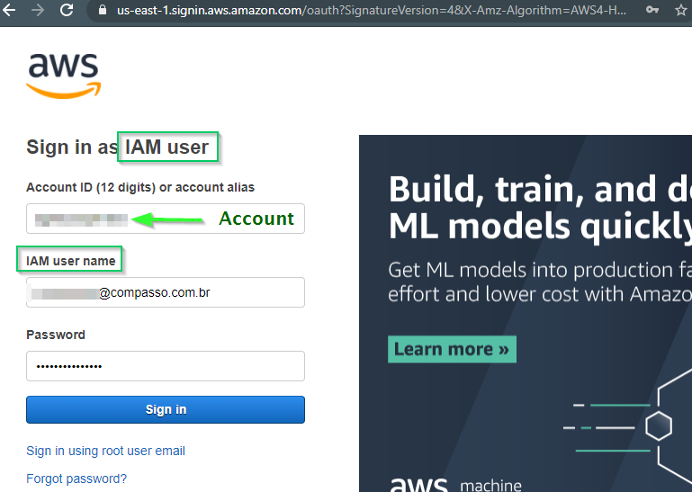

2) Será exigida a troca da senha atual:

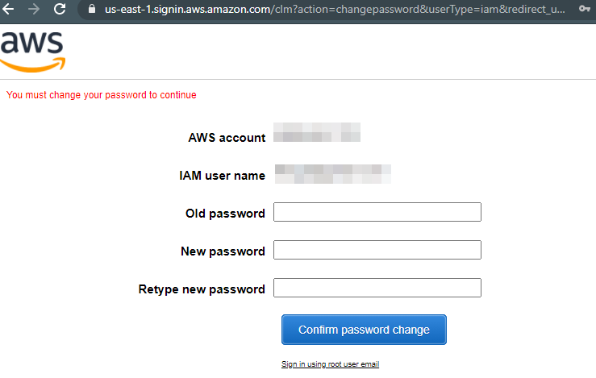

3) Confirme que após o login a região selecionada seja a correta, ex: ‘us-east-1’:

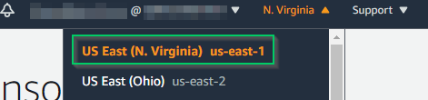


## Cadastro do dispositivo para o segundo fator de autenticação

Neste momento, ao tentar acessar qualquer funcionalidade, será apresentada uma mensagem semelhante a esta abaixo:

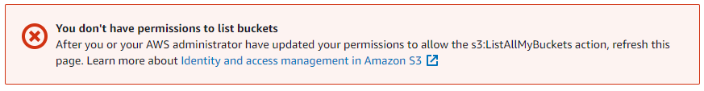

Essa mensagem indica que a política de segurança está bloqueando o seu acesso por não possuir o MFA configurado e em uso.

Para iniciar o uso, é necessário cadastrar um dispositivo para consulta do código de acesso.

Acesse a opção de gerenciamento de credenciais disponível no menu logo abaixo do e-mail logado:

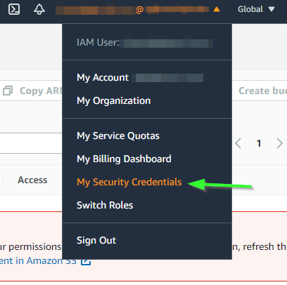

Na página que abrir, localizar a opção de atribuir dispositivo MFA:

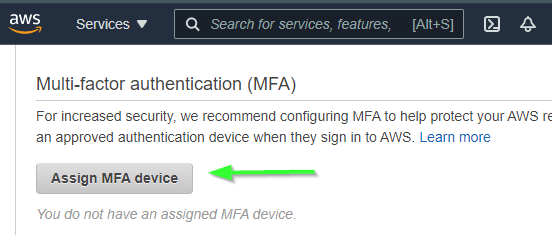

Escolha a opção de ‘Dispositivo MFA Virtual’:

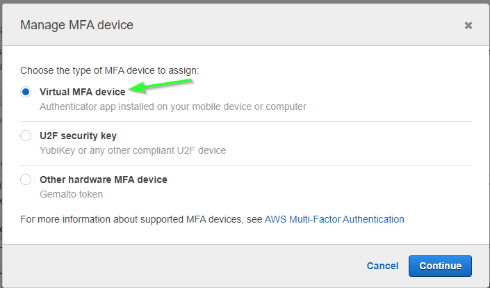

Abra o aplicativo instalado anteriormente e clique para mostar o QR Code.

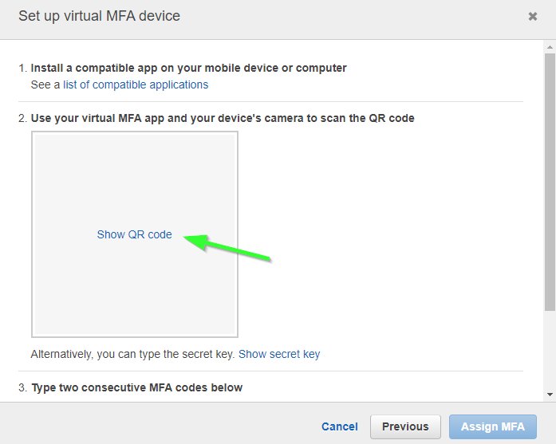

Ao ler o QR code ```(1)```  com o aplicativo, o aplicativo começará a exibir os códigos que são renovados a cada poucos segundos.

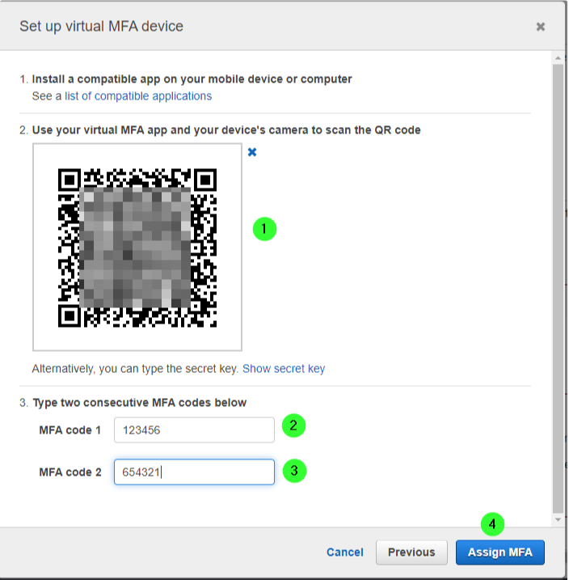

Digite dois destes códigos consectivos nos campos indicados ```(2)``` e ```(3)```.

:warning: *Para estes campos, é necessário que sejam códigos que aparecem em sequência, no caso de digitar o primeiro e ‘perder’ o segundo, comece o processo do início novamente.*

Digitados os códigos, clique no botão ```(4)``` para atribuir o seu dispositivo.

Na sequência, será apresenta mensage de que o dispositivo foi atribuído e ele aparecerá na lista de dispositivos cadastrados:

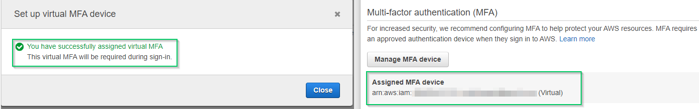

:warning: *Depois de cadastrado o dispositivo, é necessário fazer log out da conta e logar novamente.*

## Acesso depois de configurado o dispositivo MFA

Depois de configurado o dispositivo MFA será apresentada uma tela adicional depois de informados usuário e senha:

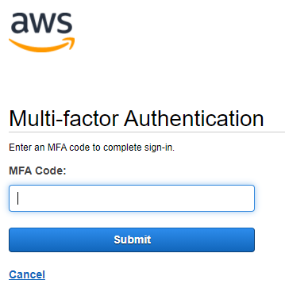

Assim, quando solicitado, informe o código que estiver sendo mostrado no aplicativo de MFA.