# Tutorial Blockchain - VS Code, Windows, Javascript

O objetivo deste tutorial é dar os passos iniciais na preparação do ambiente e no desenvolvimento de Smart Contracts.

O foco do tutorial é a plataforma Windows, a IDE VS Code e a linguagem Javascript/Typescript.

Para aprofundar no tema, faça também os tutoriais que disponibilizados direto no VS Code pela extensão que instalaremos.

*Este conteúdo e passos são baseados nesta documentação da [extensão de desenvolvimento Blockchain da IBM][1].*

---
## Pré-requisitos

### Instalações

Antes de começar, certifique-se de possuir instalado:

1. VS Code versão 1.40 ou superior. [Download](https://code.visualstudio.com/)
1. Docker versão v17.06.2-ce ou superior. [Download](https://www.docker.com/get-started)
1. Node 12.15.0 ou superior e npm v6.x ou superior. [Download](https://nodejs.org/en/download/)
1. Build Tools para C++ [Docs](https://github.com/felixrieseberg/windows-build-tools#windows-build-tools)
    * Rodar no powershell como administrador: ```npm install --global windows-build-tools```
    * Este passo deve instalar o Python27 em sua máquina, caso isso não ocorra, instale manualmente. [Download](https://www.python.org/download/releases/2.7/)
1. OpenSSL v1.0.2 ou superior [Oficial](https://www.openssl.org/community/binaries.html) ou Alternativa: [Usar openssl que vem com o git](https://git-scm.com/downloads)

### Configurações

Colocar na variável de ambiente PATH os caminhos do Python e do OpenSSL, ex:
```
PATH=%PATH%;C:\Program Files\Git\usr\bin;%USERPROFILE%\.windows-build-tools\python27\
```

Configurar variável PYTHON com o local do executável, ex:
```
PYTHON="%USERPROFILE%\.windows-build-tools\python27\python.exe"
```
---
## Instalar a extensão

Depois de confirmados os pré-requisitos, é possível instalar a extensão.

Para isso, ir até o Market place de extensões do VS Code e buscar por: *IBM Blockchain Platform*

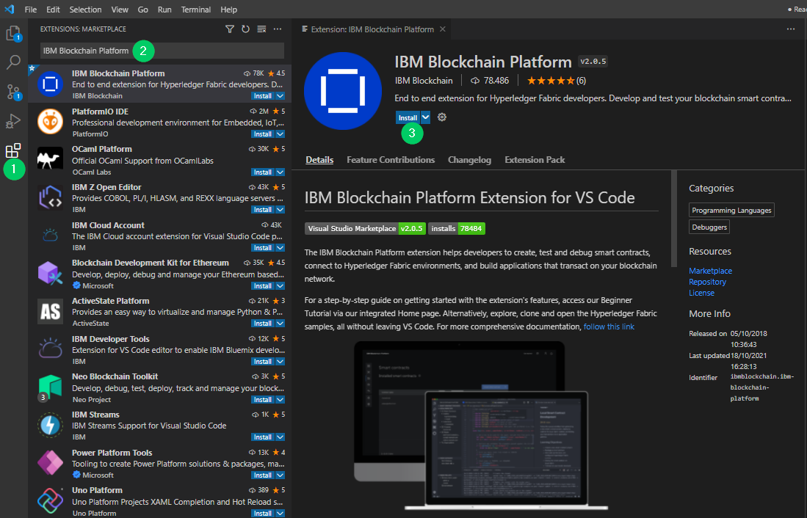

Concluída a instalação, reinicie o VS Code.

Depois de instalada a extensão será adicionado um novo ícone na barra lateral do VS Code, ao clicar neste ícone você terá acesso ao painel com as ferramentas de apoio ao desenvolvimento.

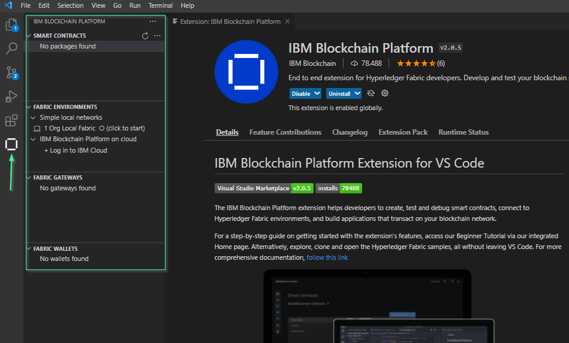

Também ficará disponível um ícone quadrado no canto superior direito do editor do VS Code:

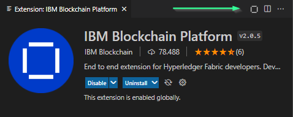

Clicando neste ícone é apresentada a página inicial dos recursos da plataforma blockchain IBM, em especial, o link para os tutoriais que podem ser seguidos dentro do próprio VS Code.

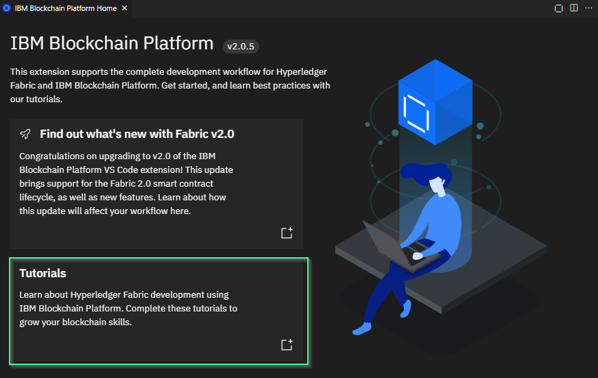

:tada: Parabéns! Seu ambiente está pronto para começar!

---
## Trabalhando com Smart Contracts

Neste tópico veremos algumas operações básicas para trabalhar com Smart Contracts.

Você terá uma noção de como criar um Smart Contract, executá-lo e visualizar os resultados.

Nos tutoriais que ficam disponíveis na página inicial, vista acima, estas operações são trabalhadas com mais profundidade, então, não deixe de continuar aprofundando os seus conhecimentos.

### Conhecendo o nosso ativo

Por fins didáticos, vamos chamar o nosso ativo de ```bilhete```, como um bilhete de loteria ou de rifa.

Normalmente a definição dos ativos segue um processo criterioso, levando em consideração vários aspectos. Porém, para simplificar e facilitar ao máximo esse contato com Blockchain, vamos chamar de ```bilhete```.

Assim, sempre que a palavra ```bilhete``` aparecer, trata-se do nosso ativo digital. :wink:

### Criação do Smart Contract

Crie uma pasta no seu sistema de arquivos para colocar os fontes do Smart Contract, como sugestão, chame-a de ```bilhete-smart-contract```.

Na barra lateral da extensão, vá ao painel ```Smart Contracts``` e clique no ícone ```...```, para abrir o menu de opções e clique em ```Create New Project```

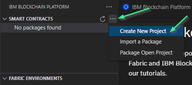

No modal apresentado, escolha a opção ```Default Contract``` (depois, busque nos tutoriais para entender a diferença entre cada uma das opções):

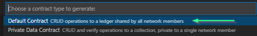

Em seguida, escolha a linguagem que pode ser a de sua preferência, no exemplo seguiremos com ```JavaScript```:

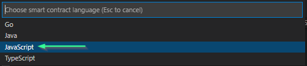

Por fim, o nome do ativo, ou seja, ```Bilhete```. 

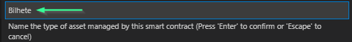

Agora selecione a pasta que você criou no início deste tópico, o nome sugerido foi ```bilhete-smart-contract```.

Então, quando solicitado, a opção ```Add to workspace```.

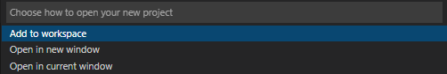

Estes passos resultarão na geração de alguns arquivos na pasta ```bilhete-smart-contract```, bem como na adição desta pasta no workspace do VS Code, com a seguinte estrutura:

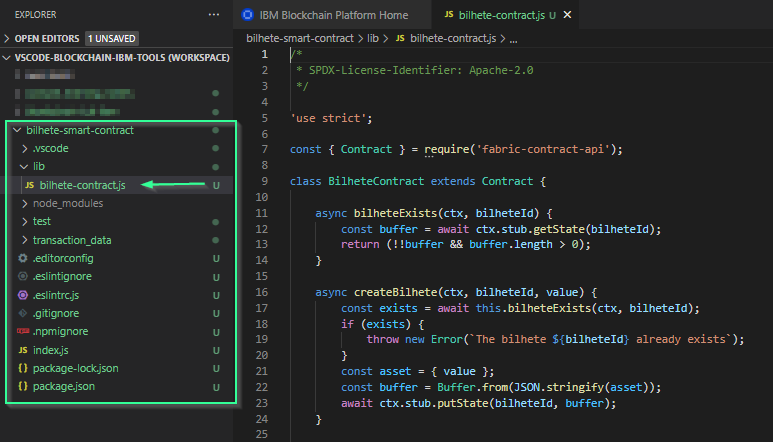

É isso aí! O ```bilhete-contract.js``` é o nosso Smart Contract!

### Empacotamento do Smart Contract

O próximo passo é criar um pacote com o Smart Contract, para que depois seja possível implantá-lo na Blockchain.

Para isso, volte na barra lateral da extensão, vá ao painel ```Smart Contracts``` e clique no ícone ```...```, para abrir o menu de opções e clique em ```Package Open Project```

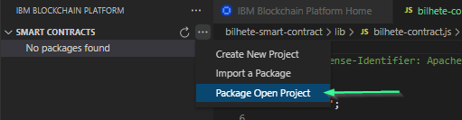

Selecione o projeto ```bilhete-smart-contract``` e a opção ```tar.gz```.

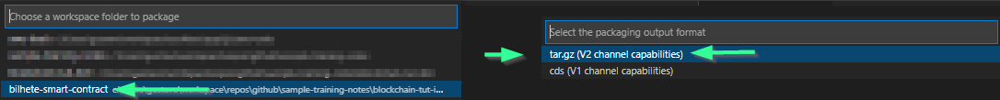

Concluído o empacotamento, agora é mostrado o pacote do nosso Smart Contract no painel ```Smart Contracts```, observe que a versão do pacote é a mesma da indicada no arquivo ```package.json```.

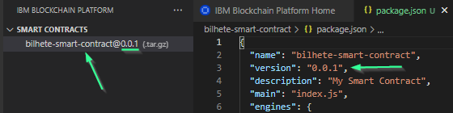

### Implantando o Smart Contract

Para este passo, você precisa confirmar que o Docker esteja rodando. Normalmente, isso pode ser feito observando o ícone do Docker na barra de ferramentas.

Com o Docker em execução, vá na barra lateral da extensão, e ao painel ```Fabric Environments``` e clique em ```1 Org Local Fabric``` para iniciar o conteiner.


Aguarde alguns instantes, você pode acompanhar o progresso na aba ```Output``` do VS Code, o tempo pode variar conforme o desempenho do computador e a velocidade da internet, uma vez que a imagem do conteiner é obtida on line.

Concluída a operação, você verá na aba ```Output``` do VS Code um log similar a:
```bash
[INFO] f230bddb739c: Pull complete
[INFO] e8c6b504d6e3: Pull complete
[INFO] Digest: sha256:a0874af85d3facff63f84be23f7a799d615f61ad1d3fb586ac4402d3af8f27cf
[INFO] Status: Downloaded newer image for ibmcom/ibp-microfab:0.0.11
[INFO] ca7ba04e2756adae5ef003f3c7f07c3005c5e1a3e9cf2f421b15acd283cd1920
[INFO] C:\Users\gustavo\.fabric-vscode\v2\environments\1 Org Local Fabric>exit /b 0 
[SUCCESS] Connected to 1 Org Local Fabric
```

Indicando que a operação foi bem sucedida.

Além disso, agora será possível visualizar outros componentes da solução Blockchain na barra lateral da extensão: 

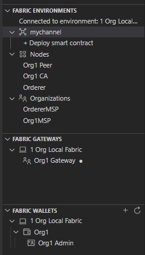

Agora, na barra lateral da extensão, dentro do painel ```Fabric Environments```, abra a opção ```mychannel``` e clique em ```Deploy smart contract```:

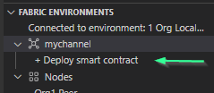

No passo 1, selecione o pacote que criamos ```bilhete-smart-contract@0.0.1```, clique em ```Next``` e depois clique em ```Deploy```.

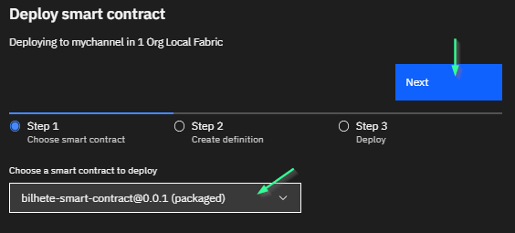

Observe o progresso na aba ```Output``` conforme a operação é executada, procure por mensagens como as seguintes:

```bash
INFO 07e Successfully endorsed commit for chaincode name 'bilhete-smart-contract' on channel 'mychannel' with definition {sequence: 1, endorsement info: (version: '0.0.1', plugin: 'escc', init required: false), validation info: (plugin: 'vscc', policy: '12202f4368616e6e656c2f4170706c69636174696f6e2f456e646f7273656d656e74'), collections: (<nil>)}
INFO 084 Chaincode with package ID 'bilhete-smart-contract_0.0.1:fc109e87189402aa883ec594f2185317e85e361352d87e58a01db64cd5f27ee5' now available on channel mychannel for chaincode definition bilhete-smart-contract:0.0.1
bilhete-smart-contract@0.0.1 start
Creating new Contract   command=run
Creating new Contract "org.hyperledger.fabric"  command=run
Registering with peer 172.17.0.2:2005 as chaincode "bilhete-smart-contract_0.01:f1db64cd5f27ee5"   command=run
Successfully registered with peer node. State transferred to "established"   command=run
```

Depois de concluído o deployment, o Smart Contract e suas operações ficam disponíveis no painel ```Fabric Gateways``` em ```Channels``` -> ```mychannel``` -> ```bilhete-smart-contract@0.0.1```.

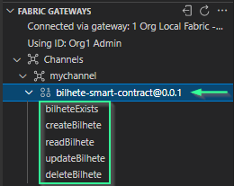

### Invocando operações do Smart Contract

As principais operações sobre o ativo já são criadas por padrão, são elas:
* Criação: ```createBilhete```
* Atualização: ```updateBilhete```
* Consulta: ```readBilhete```
* Exclusão: ```deleteBilhete```
* Verificar Existência: ```bilheteExists```

### Criação de um ativo

Primeiramente, vamos criar um novo bilhete. Considere que o identificador do ativo é o número do bilhete e o valor indicará o beneficiário do bilhete. Sendo que o valor ```___VAZIO___``` significa que o bilhete está  disponível.

Para isso, vá até a operação ```createBilhete``` no painel ```Fabric Gateways``` e dê um duplo click.

Nos argumentos da transação, insira o seguinte JSON:
```json
{
  "id": "bilhete_1",
  "value": "___VAZIO___"
}
```

Observe que o id é formado pelo nome do ativo, mais um identificador. Isso irá garantir que os ids armazenados sejam únicos.

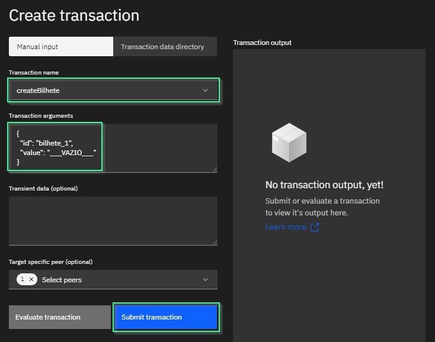

Verifique as entradas e clique em ```Submit transaction```.

Observe o progresso na aba ```Output``` conforme a operação é executada, procure por mensagens como as seguintes:

```bash
[INFO] submitTransaction
[INFO] submitting transaction createBilhete with args bilhete_1,___VAZIO___ on channel mychannel to peers org1peer-api.127-0-0-1.nip.io:8080
[SUCCESS] No value returned from createBilhete
```

Exercitar o comportamento, clique novamente em ```Submit transaction``` sem mudar o payload, desta vez aparecerá a mensagem ```The bilhete bilhete_1 already exists``` indicando que já existe o ativo. Na aba ```Output```:

```bash
[INFO] submitTransaction
[INFO] submitting transaction createBilhete with args bilhete_1,___VAZIO___ on channel mychannel to peers org1peer-api.127-0-0-1.nip.io:8080
[ERROR] Error submitting transaction: No valid responses from any peers. Errors:
    peer=org1peer-api.127-0-0-1.nip.io:8080, status=500, message=error in simulation: transaction returned with failure: Error: The bilhete bilhete_1 already exists
```


### Consulta de um ativo

Normalmente, a consulta do ativo pode ser feita pela operação ```readBilhete```, para isso, basta informar os seguintes argumentos da transação:

```json
{
  "id": "bilhete_1"
}
```

Ao submeter a transação será retornado o valor do ativo:

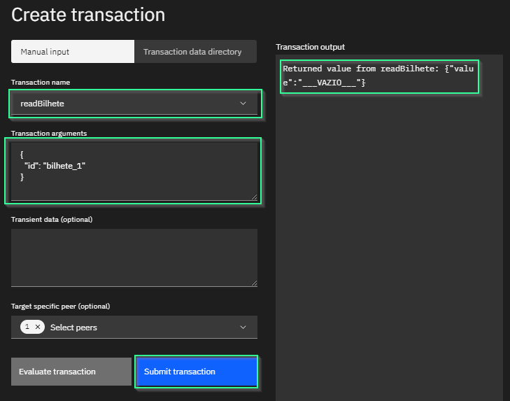

Aqui no tutorial, iremos um pouco além. Inspecionaremos direto na base de dados o que está gravado. A base dados usada pela extensão da IBM é a [CouchDB](https://couchdb.apache.org/).

Para acessá-la, clique no ícone ```...``` do painel ```Fabric Environments``` e então na opção ```Open CouchDB in browser```.

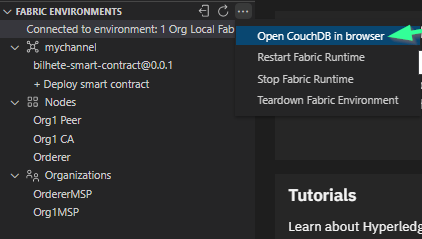

Isso abrirá um navegador com o endereço na sua própria máquina: http://couchdb.127-0-0-1.nip.io:8080/_utils/#login

Insira o username ```admin``` e a senha ```adminpw```.

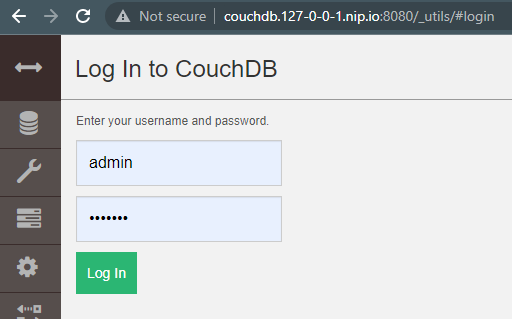

Feito o login, localize e clique na base referente ao Smart Contract do nosso ativo ```bilhete``` que é chamada ```org1_mychannel_bilhete-smart-contract```.

Observe que a base de dados já contém 1 documento, referente ao ativo que recém criamos:

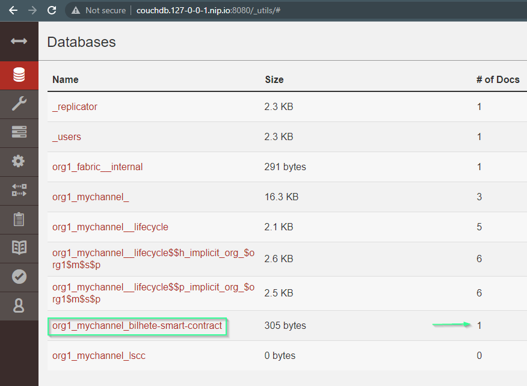

Clicando no nome da base de dados, a lista dos documentos é exibida:

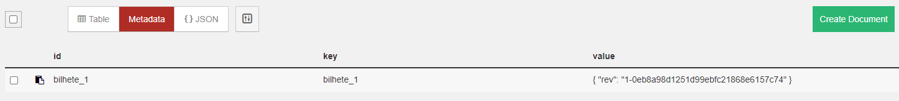

Na parte superior da lista, clique na opção ```{} JSON``` para exibir os documentos completos.

Você poderá ver no elemento ```value``` o valor do ativo, que no nosso cenário, indica que o bilhete ainda não pertence à alguém.

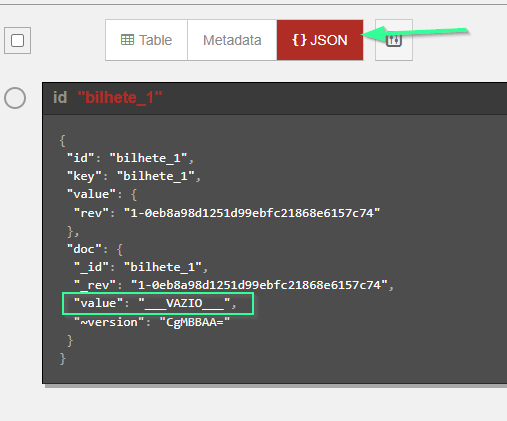


### Alterando um ativo

Agora vamos supor que o nosso bilhete foi emitido e possui um beneficiário. 

Usando a operação ```updateBilhete``` iremos atualizar o documento do ativo, alterando seu valor na base de dados.

Faremos isso com o seguinte payload na transação:

```json
{
  "id": "bilhete_1",
  "value": "GRAAC"
}
```

No formulário de criação de transações a alteração fica assim:

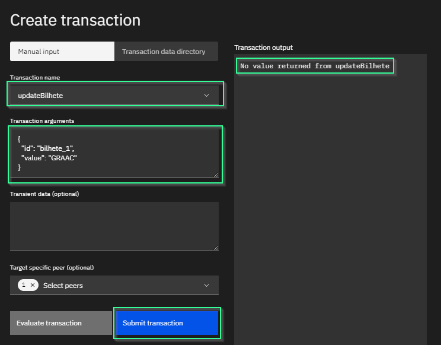

Novamente, acompanhe o resultado da transação na aba ```Output``` conforme a operação é executada, procure por mensagens como as seguintes:

```bash
[INFO] submitTransaction
[INFO] submitting transaction updateBilhete with args bilhete_1,GRAAC on channel mychannel to peers org1peer-api.127-0-0-1.nip.io:8080
[SUCCESS] No value returned from updateBilhete
```

Com isso, agora se olharmos na base de dados, veremos que o valor foi alterado.

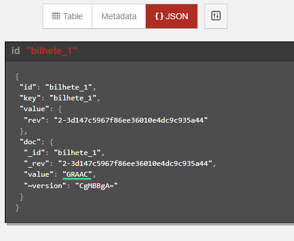

---
## Conclusão

Pronto!!! Você concluiu o tutorial!! :partying_face:

Agora você já viu como preparar o seu ambiente e fazer algumas operações básicas com Smart Contracts.

Aproveite para dar mais uma explorada nos componentes instalados, nas operações e também no código fonte que foi gerado nas pastas do projeto no VS Code.

Depois, dê continuidade nos estudos fazendo os tutoriais que são apresentados dentro da página de tutoriais da extensão instalada.

### Para reflexão

Aproveitando que está por aqui, deixamos algumas perguntas para você refletir:
* Por que a versão do Smart Contract precisa ser controlada? 
* Quais os impactos do Smart Contract estar em versões diferentes nos peers da rede?
* Se a blockchain é imutável, como conseguimos alterar o valor no ativo que criamos?

---
## Referências

[1]: https://cloud.ibm.com/docs/blockchain-sw-252?topic=blockchain-sw-252-develop-vscode
